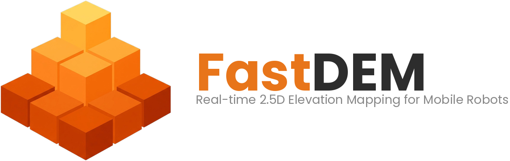

<p align="center">
  <a href="https://github.com/Ikhyeon-Cho/FastDEM">
    <picture>
      <source media="(prefers-color-scheme: dark)" srcset="assets/fastdem_logo_dark.png" />
      <source media="(prefers-color-scheme: light)" srcset="assets/fastdem_logo_light.png" />
      
    </picture>
  </a>
</p>


<p align="center">
  <a href="https://github.com/Ikhyeon-Cho/FastDEM"></a>
  <a href="#start-with-ros1"></a>
  <a href="#start-with-ros2"></a>
  <a href="https://github.com/Ikhyeon-Cho/FastDEM/blob/main/LICENSE"></a>
  <a href="https://github.com/Ikhyeon-Cho/FastDEM/actions/workflows/build.yml"></a>
</p>

> <p align="center"><i><b>Ultra-fast elevation mapping</b> on <b>embedded</b> robots — <b>100+ Hz</b> on Jetson Orin</i></p>

<p align="center"><b><a href="#start-with-ros1">ROS1</a></b> · <b><a href="#start-with-ros2">ROS2</a></b> · <b><a href="#use-fastdem-as-a-c-library">C++ Library</a></b></p>


<p align="center">
  
  
  
</p>


FastDEM is a lightweight C++17 library that builds dense elevation maps from LiDAR and RGB-D point clouds in real time, without GPU. It supports both robot-centric local mapping and fixed-origin global mapping, with built-in post-processing for terrain analysis.

**See also:**
- **[LeSTA](https://github.com/Ikhyeon-Cho/LeSTA)** — Self-supervised traversability learning for mobile robots (*RA-L 2024*)

---

## Features

* ***Fast*** — 100+ Hz on Jetson Orin. ~10ms per scan, on CPU alone.
* ***Lightweight*** — Only three system dependencies. No PCL, OpenCV, or GPU required.
* ***ROS-agnostic*** — Clean C++ API, with optional ROS support.
* ***Sensor-Aware*** — Physics-based sensor models for LiDAR and RGB-D range measurements.
* ***Multiple Estimators*** — Kalman Filter (parametric), P² Quantile estimator (non-parametric).
* ***Local + Global Mapping*** — Robot-centric or map-centric terrain mapping.
* ***Post-processing*** — Raycasting, Uncertainty fusion, Inpainting, Feature extraction, and more.

---

## Performance

The mapping pipeline runs at **~10 ms** on embedded CPUs — fast enough to leave ample room for post-processing.

<p align="center">
  
</p>

*Measured with Velodyne VLP-16 (~30K pts/scan) · 15×15 m map at 0.1 m resolution*

---

## Dependencies

- **Eigen3** — Linear algebra
- **yaml-cpp** — Configuration parsing
- **spdlog** — Logging

---

## Start with ROS1

**Prerequisites:** Ubuntu 20.04, [ROS Noetic](http://wiki.ros.org/noetic/Installation)

```bash
# Dependencies
sudo apt install libeigen3-dev libyaml-cpp-dev libspdlog-dev
sudo apt install ros-noetic-grid-map-msgs ros-noetic-tf2-eigen

# Clone and build
cd ~/catkin_ws/src
git clone https://github.com/Ikhyeon-Cho/FastDEM.git
catkin build fastdem_ros

# Run (add global_mapping:=true for map-centric mode)
roslaunch fastdem_ros run.launch rviz:=true
```

Configuration: [`ros1/config/local_mapping.yaml`](ros1/config/local_mapping.yaml) · [`ros1/config/global_mapping.yaml`](ros1/config/global_mapping.yaml)

---

## Start with ROS2

**Prerequisites:** Ubuntu 22.04, [ROS2 Humble](https://docs.ros.org/en/humble/Installation.html)

*Other ROS2 distributions may also work but are not yet tested.*

```bash
# Dependencies
sudo apt install libeigen3-dev libyaml-cpp-dev libspdlog-dev
sudo apt install ros-humble-grid-map-msgs ros-humble-tf2-eigen

# Clone and build
cd ~/ros2_ws/src
git clone https://github.com/Ikhyeon-Cho/FastDEM.git
colcon build --packages-up-to fastdem_ros2

# Run (add global_mapping:=true for map-centric mode)
ros2 launch fastdem_ros2 run.launch.py rviz:=true
```

Configuration: [`ros2/config/local_mapping.yaml`](ros2/config/local_mapping.yaml) · [`ros2/config/global_mapping.yaml`](ros2/config/global_mapping.yaml)

---

## Use FastDEM as a C++ Library

FastDEM can be used without ROS as a standalone C++ library.

```bash
# Dependencies
sudo apt install libeigen3-dev libyaml-cpp-dev libspdlog-dev

# Clone and build
git clone https://github.com/Ikhyeon-Cho/FastDEM.git
cd FastDEM/fastdem
mkdir build && cd build
cmake ..
make -j$(nproc)
sudo make install
```

```cpp
#include <fastdem/fastdem.hpp>

fastdem::ElevationMap map;
map.setGeometry(15.0, 15.0, 0.1);  // width, height, resolution [m]

auto cfg = fastdem::loadConfig("config/default.yaml");
fastdem::FastDEM mapper(map, cfg);

// With explicit transforms
mapper.integrate(cloud, T_base_sensor, T_world_base);
```

---

## Citation

FastDEM was originally developed for the following research:

**['Learning Self-supervised Traversability with Navigation Experiences of Mobile Robots'](https://github.com/Ikhyeon-Cho/LeSTA)**
*IEEE Robotics and Automation Letters (RA-L), 2024*

```bibtex
@article{cho2024learning,
  title={Learning Self-Supervised Traversability With Navigation Experiences of Mobile Robots: A Risk-Aware Self-Training Approach},
  author={Cho, Ikhyeon and Chung, Woojin},
  journal={IEEE Robotics and Automation Letters},
  year={2024},
  volume={9},
  number={5},
  pages={4122-4129},
  doi={10.1109/LRA.2024.3376148}
}
```

---

<div align="center">

**Contact:** [ikhyeon.c@gmail.com](mailto:ikhyeon.c@gmail.com)

BSD-3-Clause License © [Ikhyeon Cho](mailto:ikhyeon.c@gmail.com)

</div>
