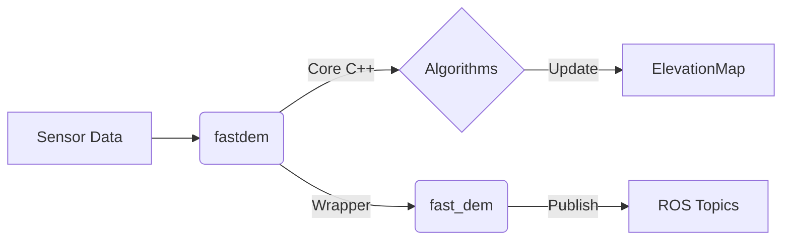

<div align="center">

# FastDEM: Ultra-Fast 2.5D Terrain Reconstruction for Mobile Robots
**A lightweight, C++ optimized elevation mapping engine designed for real-time perception and navigation**

[](LICENSE)
[](https://en.cppreference.com/w/cpp/17)
[](https://wiki.ros.org/noetic)
[](https://wiki.ros.org/noetic)
[]()

> **10x Faster** than existing solutions — **3ms** per frame (CPU only)

**The elevation mapping C++ library that just works with or without ROS.**

<br>

<p align="center">
  
  
</p>

</div>

---

## Why is it Fast?


*   **Cache-friendly** with optimized memory layout.
*   **Lightweight:** Built-in `nanoPCL` headers (2-10x faster than standard PCL) and no heavy dependencies.


---

## Features

*   **Extreme Performance:** Real-time mapping on embedded CPUs (Jetson, Raspberry Pi).
*   **ROS-Agnostic Core:** Pure CMake architecture. Use it in **ROS 1**, **ROS 2**, or **Standalone C++**.
*   **Robust Estimators:** Supports `Welford Mean`, `Kalman Filter`, and `P² Quantile`.
*   **Smart Operations:** Raycasting (ghost obstacle removal), Inpainting (hole filling), and Uncertainty Fusion (spatial ECDF).
*   **Minimalist:** Only requires `Eigen3`, `yaml-cpp`, and `spdlog`.

---

## Quick Start

### 1. Installation

**Prerequisites:** Ubuntu 20.04+, C++17, Eigen3, yaml-cpp, spdlog

```bash
# Clone the repository
git clone https://github.com/Ikhyeon-Cho/FastDEM.git

# Build (Release mode is CRITICAL for performance)
cd FastDEM/fastdem
mkdir -p build && cd build
cmake .. -DCMAKE_BUILD_TYPE=Release
make -j$(nproc)
```

### 2. Run with ROS (Optional)

```bash
# Install ROS dependencies (for fastdem_ros wrapper only)
sudo apt install ros-noetic-grid-map ros-noetic-grid-map-visualization

# Start mapping with visualization
roslaunch fast_dem mapping.launch rviz:=true
```

### 3. Standalone C++ Usage (No ROS)

Ideal for custom SLAM pipelines or non-ROS systems.

```cpp
#include <fastdem/fastdem.hpp>

int main() {
    // 1. Setup map and mapper
    fastdem::ElevationMap map;
    map.setGeometry(15.0f, 15.0f, 0.1f);

    fastdem::FastDEM mapper(map);
    mapper.setHeightRange(-1.0f, 2.0f)
          .setDistanceRange(0.5f, 10.0f)
          .setEstimatorType(fastdem::EstimationType::Kalman)
          .setSensorModel(fastdem::SensorType::LiDAR);

    // 2. Integration Loop
    while (true) {
        // T_base_sensor: Sensor extrinsic (Sensor -> Robot)
        // T_world_base: Robot pose (Robot -> World)
        mapper.integrate(cloud, T_base_sensor, T_world_base);

        // Access the 2.5D elevation map
        float elevation = map.elevationAt(position);
    }
}
```

---

## Architecture

The project is strictly decoupled: The **Core Library** has zero knowledge of ROS.



*   **`fastdem/`**: Core algorithms, map data structures, and spatial operations. **(Pure CMake)**
*   **`fastdem_ros/`**: Thin interface layer handling ROS messages and TF2. **(Catkin, package name: fast_dem)**

<details>
<summary><b>See detailed folder structure</b></summary>

```
fastdem/
├── include/fastdem/
│   ├── fastdem.hpp              # Unified API (FastDEM class)
│   ├── elevation_map.hpp        # ElevationMap + layer constants
│   ├── point_types.hpp          # PointCloud, Point, Color aliases
│   ├── transform_interface.hpp  # Calibration, Odometry interfaces
│   ├── config/          # Configuration structs
│   ├── mapping/         # Height estimation & rasterization
│   ├── sensors/         # Uncertainty models (LiDAR, RGB-D)
│   ├── postprocess/     # Raycasting, Inpainting, Uncertainty Fusion
│   └── io/              # Binary snapshot & Image export
└── lib/
    ├── nanoPCL/         # High-performance point cloud processing
    └── grid_map_core/   # Vendored grid_map core
```
</details>

---

## Configuration

Highly configurable via YAML. Performance can be tuned by enabling/disabling filters.

<details>
<summary><b>Click to view config/default.yaml</b></summary>

```yaml
map:
  width: 15.0           # Local map width (meters)
  height: 15.0          # Local map height (meters)
  resolution: 0.1       # meters/cell
  mode: "local"         # local (robot-centric) | global (fixed-origin)

scan_filter:
  z_min: -0.5
  z_max: 2.0
  range_min: 0.5
  range_max: 20.0

estimation:
  type: "kalman_filter"  # kalman_filter | welford | p2_quantile

sensor_model:
  type: "lidar"          # constant | lidar | rgbd

raycasting:
  enabled: true          # Ghost obstacle removal via temporal voting

inpainting:
  enabled: true          # Infill missing data using neighbors

uncertainty_fusion:
  enabled: true          # Neighborhood-aware uncertainty (weighted ECDF)
```
</details>

---

## Citation

If you use this project in your research, please cite our paper:

**['Learning Self-supervised Traversability with Navigation Experiences of Mobile Robots'](https://github.com/Ikhyeon-Cho/urban-terrain-dataset)**
*IEEE Robotics and Automation Letters (RA-L), 2024*

```bibtex
@article{cho2024learning,
  title={Learning Self-Supervised Traversability With Navigation Experiences of Mobile Robots: A Risk-Aware Self-Training Approach},
  author={Cho, Ikhyeon and Chung, Woojin},
  journal={IEEE Robotics and Automation Letters},
  year={2024},
  volume={9},
  number={5},
  pages={4122-4129},
  doi={10.1109/LRA.2024.3376148}
}
```

---

<div align="center">

**[Examples](fastdem/examples/)** · **[Report Bug](https://github.com/Ikhyeon-Cho/FastDEM/issues)** · **[Korea University](https://reals.korea.ac.kr/)**

BSD-3-Clause License © [Ikhyeon Cho](mailto:tre0430@korea.ac.kr)

</div>
